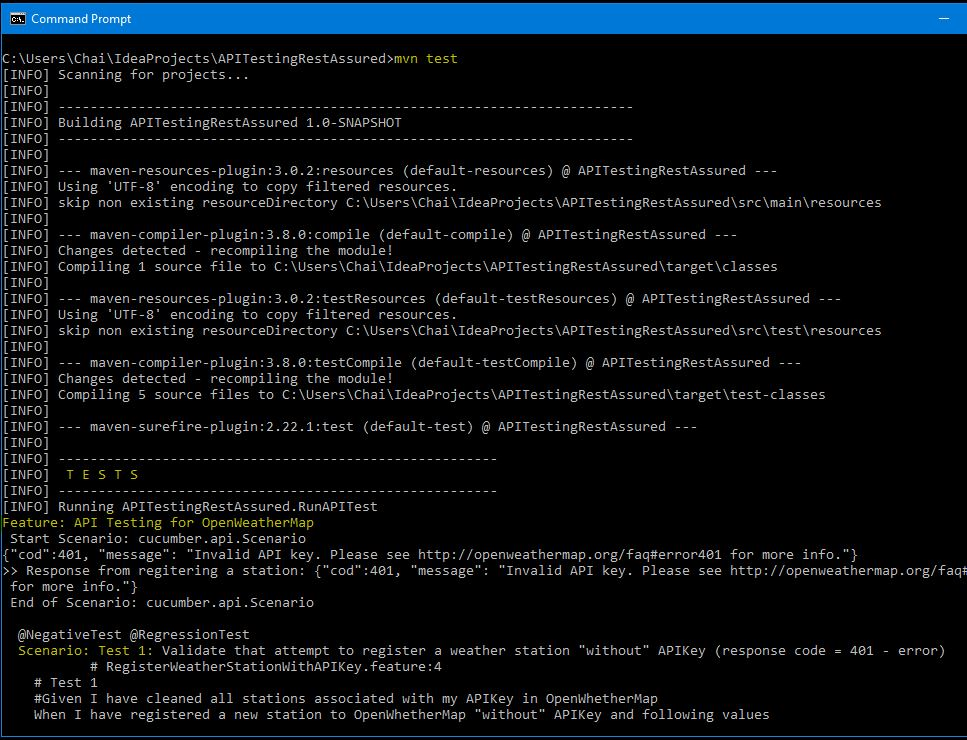
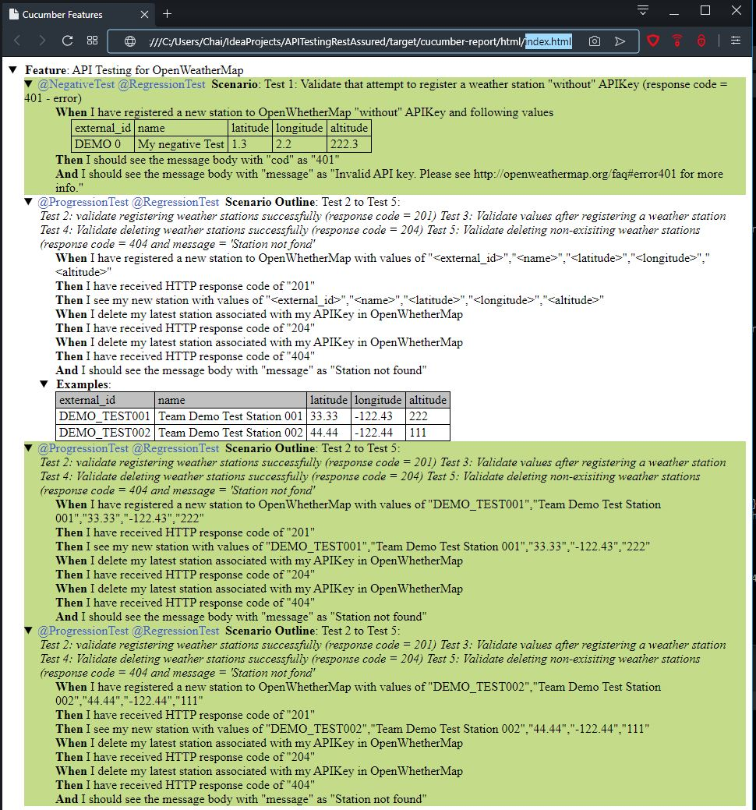

# **API Testing Scenario**
API Test Framework Example in Java language using Java libraries; 
RestAssured (for API Service) and Cucumber (for BDD styled), along with Maven as a build tool.

#   Table of Contents

* [Overview](#overview)
* [How to setup](#howtosetup)
* [How to run tests and generate reports](#howtoruntests)
* [Where to find Reports](#reports)
* [Examples of Test Execution and HTML report](#outputexamples)
* [Jenkins (CI/CD) Integration setup guideline](#jenkins)

<a name="overview"></a>
## 1. Overview 

* This API test framework uses Java as a main language with 'RestAssured' and 'Cucumber' libraries 

* Test will run according to feature files - which are stored under 
./src/test/java/featureFiles folder. 

* Outputs (Json, XML and html files) will be produced under ./target/cucumber-reports folder.

<a name="howtosetup"></a>
## 2. How to setup
___

Pull (clone) source code from Git as below command: 

```git
git clone git@github.com:pichai-t/OpenWeatherMap-RestAssured.git
```

Then tests can be run as mentioned in the next step.

> Note: Git client and Maven are required to setup and run
> * [Git Installation](https://www.atlassian.com/git/tutorials/install-git)
> * [Apache Maven Installation](http://maven.apache.org/install.html/) 
--- 

<a name="howtoruntests"></a>

## 3. How to run tests and generate reports
 
 Run CLI: "<code>mvn test -Dcucumber.options="--tags @RegressionTest"</code>" to build and execute tests

```batch
mvn test -Dcucumber.options="--tags @RegressionTest"
```

> Note: or just simply run <code> mvn test </code> to use default 'tags' defined in RunAPITest.java. 

This command will run only any scenario(in feature files) with tag as '@RegressionTest'.

Once finished, there will be reports in ./target/cucumber-reports/* folder.   

---

<a name="reports"></a>
## 4. Where to find reports

* JSON file: ./target/cucumber-reports/Cucumber.json
* XML file: ./target/cucumber-reports/Cucumber.xml
* HTML file: ./target/cucumber-reports/html/index.html

---
<a name="jenkins"></a>
## 5. Jenkins (CI/CD) Integration setup guideline
In your new Jenkins Job:

5.1) Under Git Integration: pull source code from github:
        
```git
git clone git@github.com:pichai-t/OpenWeatherMap-RestAssured.git
```

5.2) Add step: to run maven (build and run goal as 'test')

Two options:  

   * Run with the 'default' tags under <code> Cucumber.options {...} </code> in RunAPITest.java
        ```batch
        mvn test 
        ```  
   * Run with selective tags by passing parameters as below 
        
        ```batch
        mvn test -Dcucumber.options="--tags @RegressionTest"
        ```

5.3). If needed, JUnit and HTML reports can be used for further integrations (Jenkins build itself or other integrations; such as Jira, qTest.
* JUnit file: ./target/cucumber-reports/Cucumber.xml 
* HTML file: ./target/cucumber-reports/html/index.html

---
<a name="outputexamples"></a>
## 6. Examples of Test Execution and HTML report





--- 